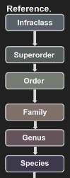

# Plankton Analysis
Plankton Classification and Prediction

## Data Collection

Images of plankton were collected through cameras in the ocean. They were preprocessed to eliminate backgroung noise and locate region of interest (plankton specimen).

The following experiments were conducted on a dataset of over 120,000 plankton images.

## Classification on Taxonomical Levels

### Direct Classification on Collected Data

Dataset was partitioned into training, validation and test sets with 70%, 10%, and 20% split. For a baseline score, Alexnet with ImageNet weights were used and then finetuned on our dataset.

Classification were performed on various taxonomical levels, including Class, Order and Species levels. A taxonomical hierarchy graph is shown below. 

High accuracy results, above 90%, were obtained from classification experiments. An example of confusion matrix on taxonomical Class level is shown below.

### Transfer Learning with Google Data

To test the usefulness of our data, a CNN was trained on our data and then used on plankton data collected from Google image search. The trained network was applied on Google data to generate a 4096 dimensional latent vector for each image. SVM was trained and tested on the latent vectors. The results are shown below.

